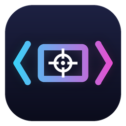

<p align="center"></p>

<h1 align="center">StretchScaler</h1>

<p align="center">Stretched res for H1Z1 (ROTK, Zemu, etc.) without the slow Alt+Tab.<br>
<a href="../../releases/latest"><b>Download</b></a></p>

## Why

I wanted 1920x1440 stretched on my 1440p monitor, but exclusive fullscreen made Alt+Tab take forever and
sometimes throw me right back into the game. Windowed fullscreen fixes Alt+Tab but kills the stretch, and
Borderless Gaming just makes the game re-render at 16:9.

So this keeps H1Z1 as a normal 4:3 window, captures it on the GPU, and draws it stretched across your whole
monitor in a borderless window on top. The game never gets resized and your desktop resolution never
changes, so you keep the stretch and Alt+Tab is instant.

No injection, no hooks, nothing touches the game's memory. It's the same kind of window capture OBS and
Discord use.

## Setup

**1. H1Z1 settings.** Close the game and edit `UserOptions.ini` in your game folder:

```ini
[Display]
Maximized=0
Mode=Windowed
FullscreenMode=Windowed
WindowedWidth=1920
WindowedHeight=1440
```

Use the 4:3 size that matches your monitor height:

| Monitor | WindowedWidth x WindowedHeight |
|---|---|
| 1920x1080 | 1440x1080 |
| 2560x1440 | 1920x1440 |
| 3840x2160 | 2880x2160 |

**2. PC settings.**
- Leave Windows at your monitor's normal resolution and refresh rate. You don't need CRU, custom
  resolutions or GPU scaling for this, so undo them if you set any up.
- Windows display scale on your gaming monitor should be 100%. If it isn't, go to H1Z1.exe > Properties >
  Compatibility > Change high DPI settings, and set "Override high DPI scaling" to Application.

**3. Run it.** Grab the zip from [Releases](../../releases/latest), extract it, run `StretchScaler.exe` and
pick your gaming monitor. Then launch the game. It stretches automatically after a few seconds.

Closing the window leaves it running in the tray, so you only open it once per session.

## Hotkeys

- `Ctrl+Alt+S` turn scaling on/off
- `Ctrl+Alt+X` panic stop (also gives your cursor back)

## Good to know

- It asks for admin so the FPS counter can show your real game FPS. Without admin it only shows how many
  frames hit the screen.
- Alt+Tab minimizes the game so you get a clean desktop. Click it on the taskbar to jump back in. You can
  turn this off.
- Latency is close to playing in a normal window. The stretched output skips the second trip through the
  Windows compositor. More detail and tips are in [docs/latency.md](docs/latency.md).
- Community servers have their own rules. Check yours before using any third party tool. Use at your own risk.

## Something broken?

Open an [issue](../../issues/new/choose) and paste your `StretchScaler.log` (it's next to the exe). Most problems
are the game not actually being in Windowed 4:3, so check that the app shows `client 1920x1440 (4:3 OK)`.

## Building

You need Visual Studio 2022 or newer with the "Desktop development with C++" workload. Run `build.bat` and
the exe ends up in `bin\`. GitHub also builds every push, and tags like `v1.2.0` turn into releases.

PRs are welcome, see [CONTRIBUTING.md](CONTRIBUTING.md). If you want a more general scaler,
[Magpie](https://github.com/Blinue/Magpie) is great and uses the same capture approach.

MIT licensed.
